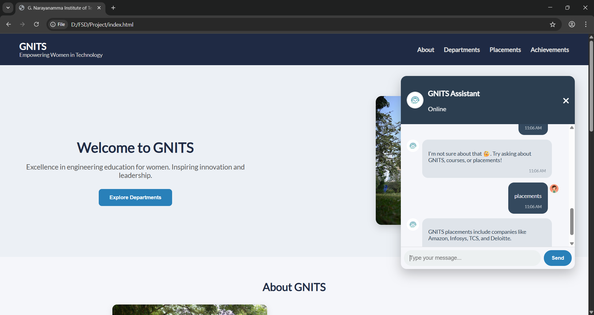
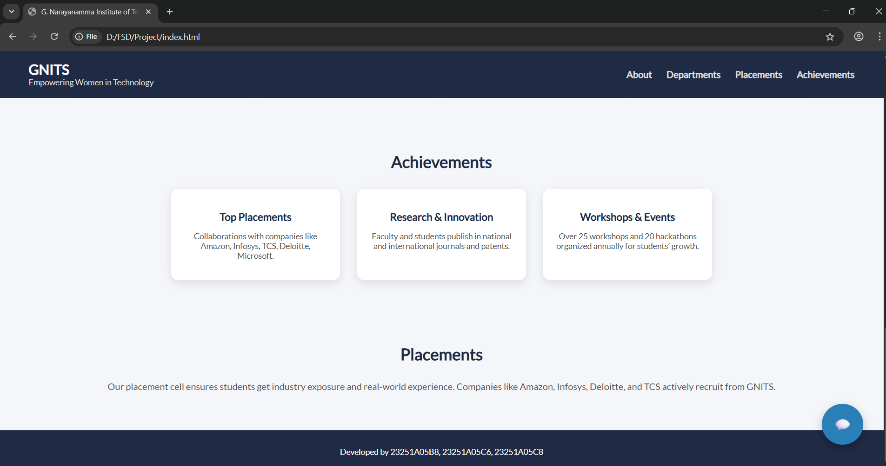
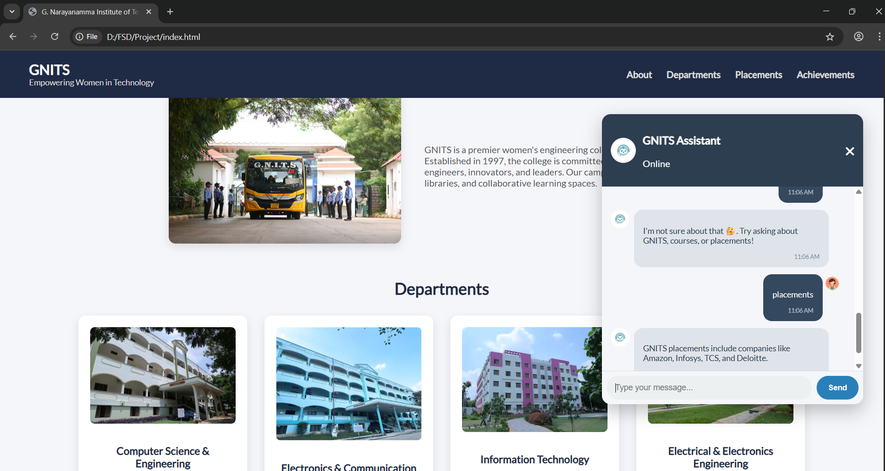

# 🧠 Chatbot Module – GNITS  

## 📘 Introduction  
This project is a **Chatbot Module** developed as part of the **Full Stack Development (FSD)** course.  
It is designed for the **G. Narayanamma Institute of Technology and Science (GNITS)** website to help users get quick answers about the college.  
The chatbot does not include backend part as of now. 

---

## 🖥️ Output  
- A **professional college website interface** with navigation sections such as *About, Departments, Placements,* and *Achievements.*  
- An **AI-powered chatbot** integrated using **Kommunicate/Dialogflow**, which responds to queries like “placements,” “departments,” etc.  
- Displays placement details, top recruiters, and college highlights.  

Screenshots of the working project:  
## 📸 Screenshots

**Homepage**

**Chatbot icon floating**

**Departments Section**

---

## 👩‍💻 Developed By  
**FSD Project Team – GNITS**  
- 23251A05B8  
- 23251A05C6  
- 23251A05C8  
